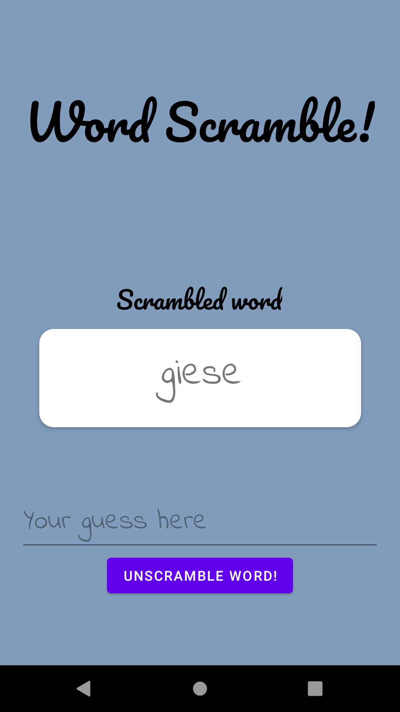
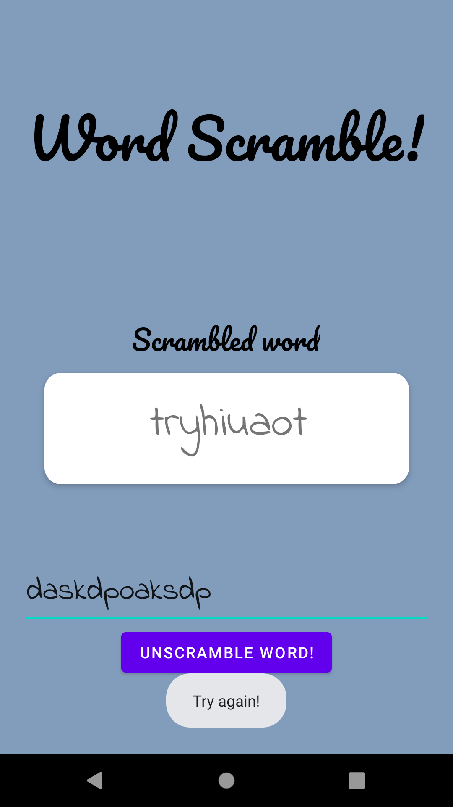
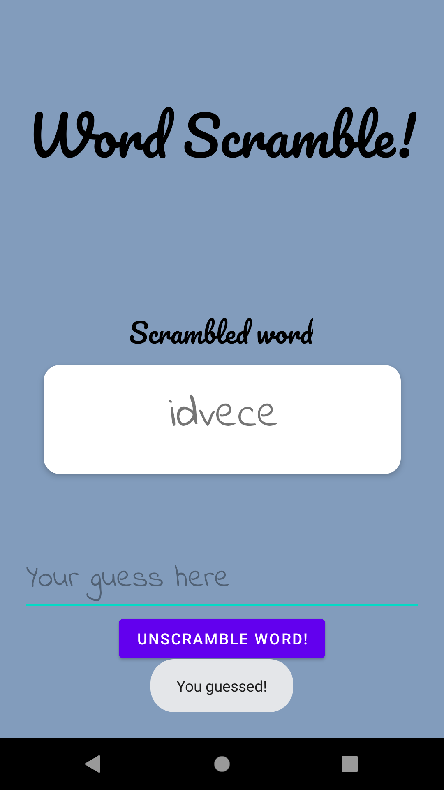

## Лабораторна робота №2
# Завдання №1
 
Створена листівка має вигляд, представлений на скриншоті нижче:

  

# Завдання №2
Робота застосунку "WordScramble" представлена на скриншотах нижче.
Початковий вигляд вікна:

  

Вигляд ввікна у випадку неправильного введення слова:

  

Вигляд ввікна у випадку правильного введення слова:

  

