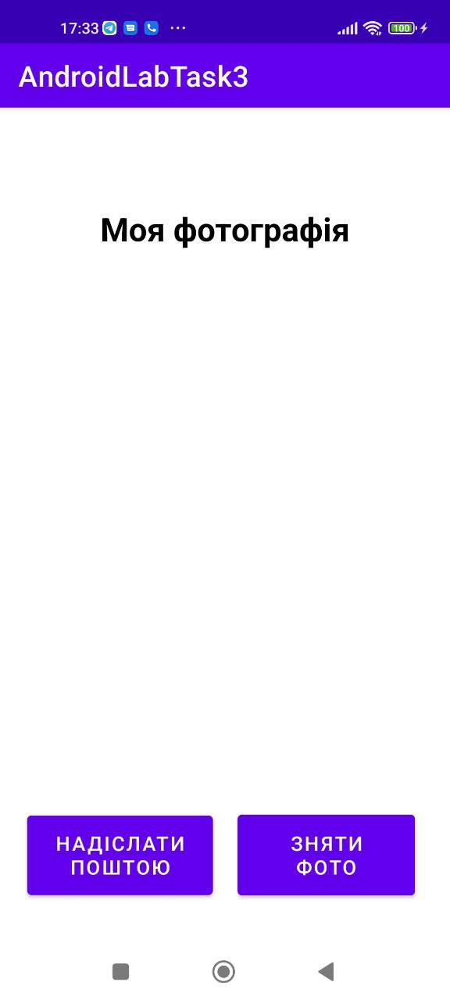
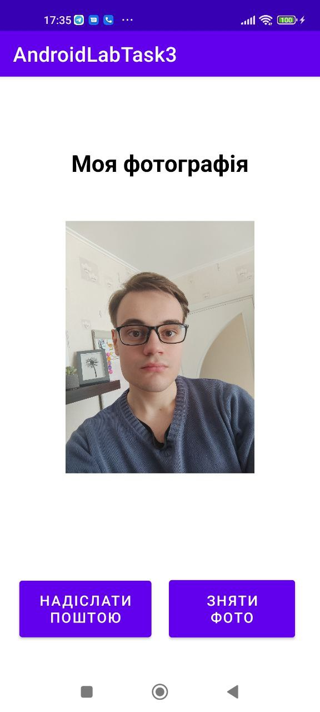
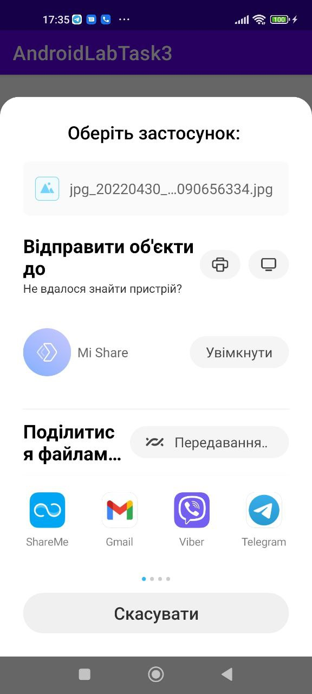
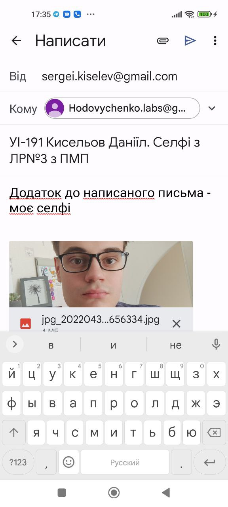
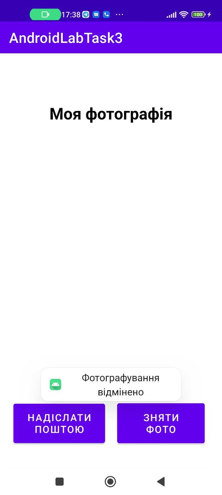

## Лабораторна робота №3
# Застосунок, який надсилає селфі на пошту
 
Робота із створеним застосункому представлена на скриншотах нижче.

Початковий вигляд вікна:

  

Вікно після того, як була зроблена фотографія. Відповідно, зроблена фотографія відображається у елементів imageView:

  

Список запропанованих застосунків для надсилання фотографії:

  

Вигляд заготовки письма у Gmail:

  

Виведення повідомлення про помилку, якщо користувач закрив камеру, не зберігши фотографію:

  

