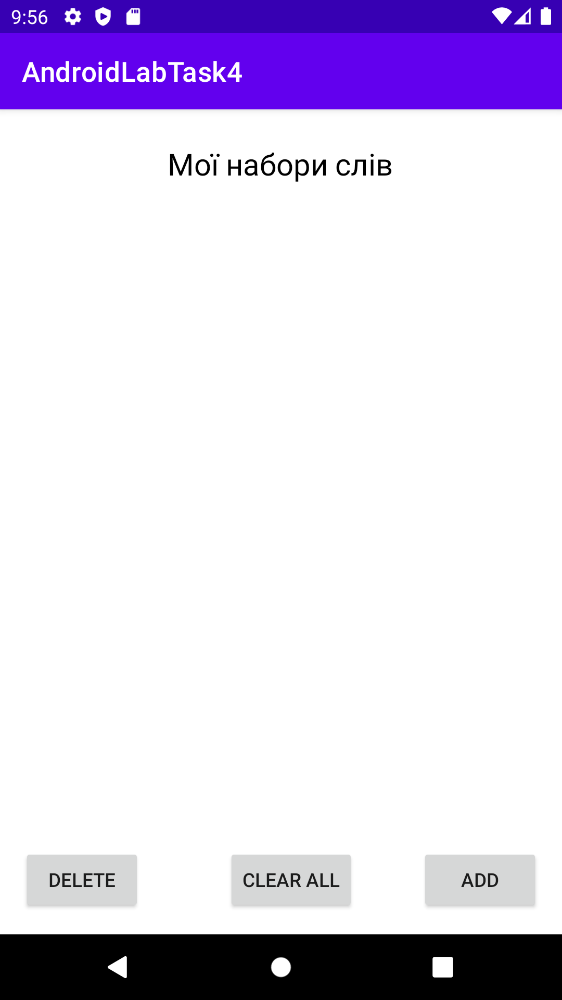
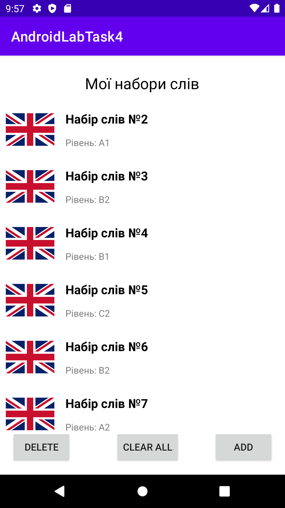

## Лабораторна робота №4
# Створення RecycleView за темою курсової роботи
 
Темою курсової роботи - "Написання застосунку для вивчення іноземних мов".

У даному RecyclerView містяться набори нових слів, які користувач зможе вивчати у подальшому.
Для кожного з наборів вказана мова, його назва та рівень володіння мовою, який потрібно мати для вивчення.
У даній лабораторній роботі характеристики кожного з елементів RecyclerView генерувались випадково.
На скриншотах представлена робота із створеним RecyclerView.

Початковий вигляд вікна із створеним RecyclerView:

  

До вікна додано 7 випадкових наборів слів:

  

Із вікна видалено останні 4 набори слів:

  

