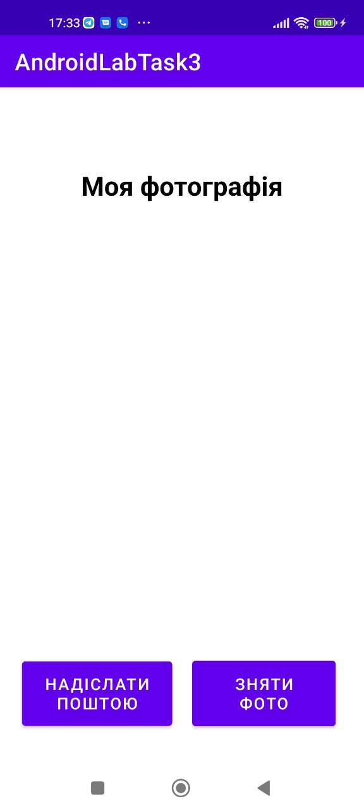
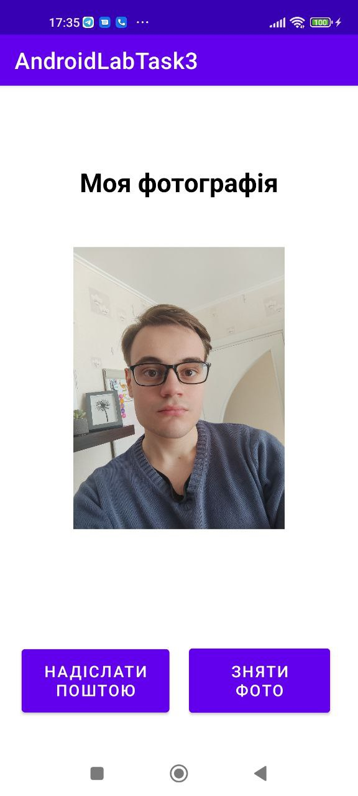
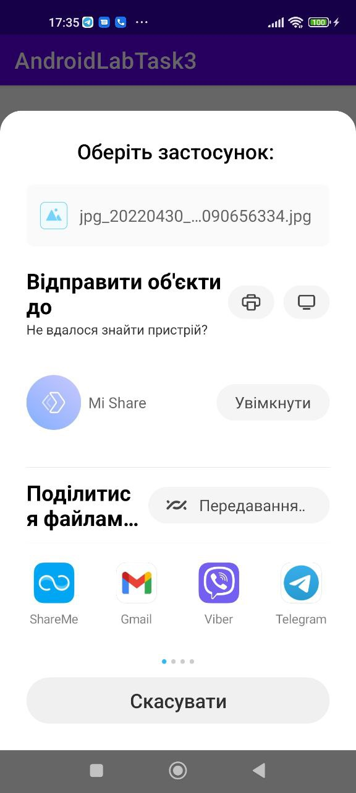
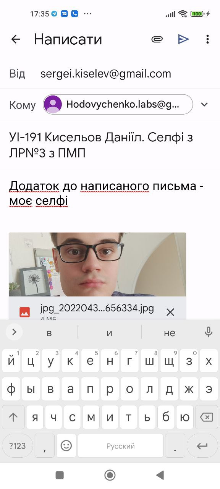
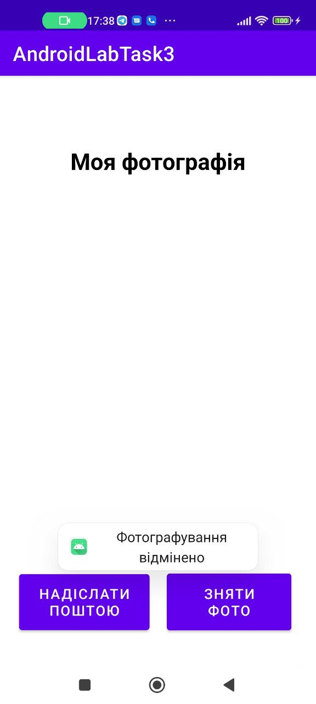

## Лабораторна робота №5
# Фрагменти в Android. Робота з віджетами TabLayout та ViewPager2
 
Робота із створеним застосункому представлена на скриншотах нижче.

#Завдання 1
Для виконання першого завдання було створено макет, який складається з 4-х фрагментів.
Для цього макету було створено 2 варіації - для альбомної та портретної орієнтацій.
Вигляд застосунку при портретній орієнтації:

  

Вигляд застосунку при альбомній орієнтації:

  

 
#Завдання 2
Для виконання даного завдання було використано віджети ViewPager2 та TabLayout.
У кожній з трьох вкладок відкривався заздалегідь створений фрагмент із певним зображенням.
Перша вкладка:

  

Друга вкладка:

  

Третя вкладка:

  

