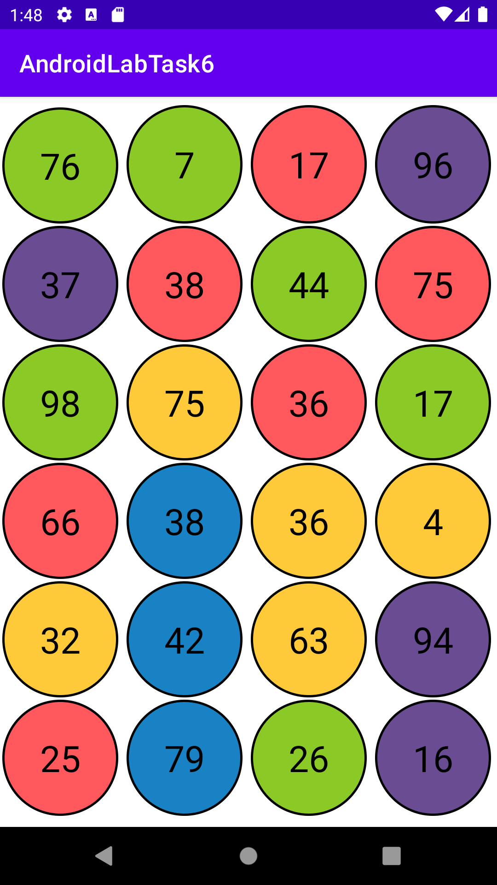

## Лабораторна робота №6
# Робота з діалогами
 
Робота зі створеним застосункому представлена на скриншотах нижче.

# Завдання 1
При виконанні даного завдання було використано такі засоби, як 
RecyclerView, адаптер та діалгои.
Вигляд головного вікна програми, яке містить сітку із N елементів:

  

Діалогове вікно при натисканні на елемент з номером 75:

  

 
Діалогове вікно при натисканні на елемент з номером 16:

  

Діалогове вікно при натисканні на елемент з номером 17:

  

