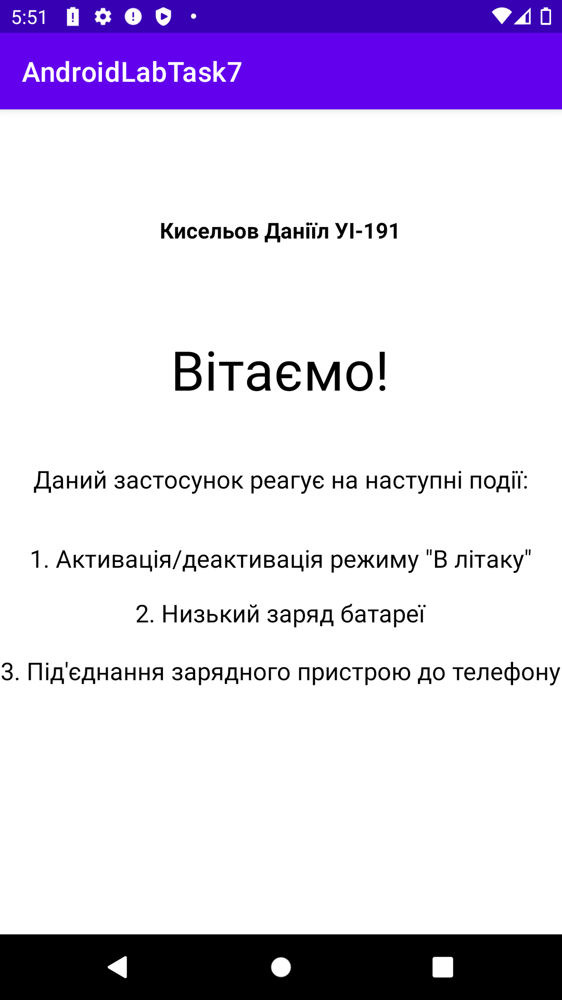
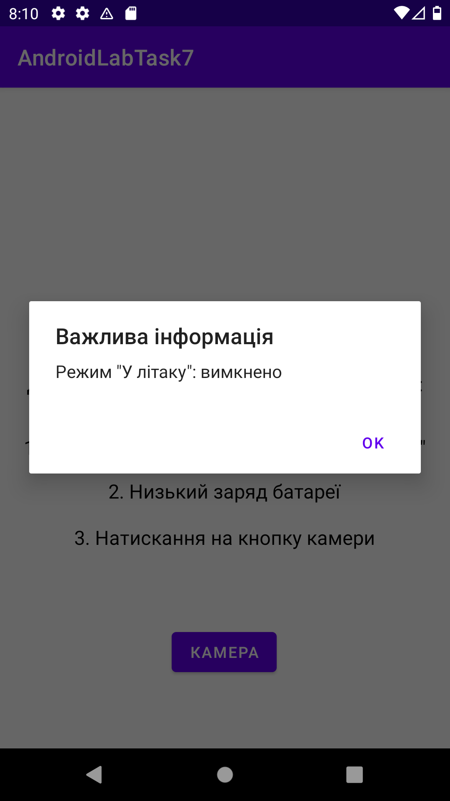
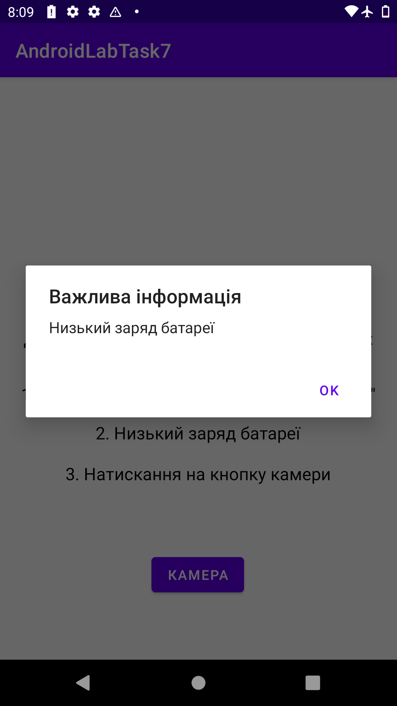
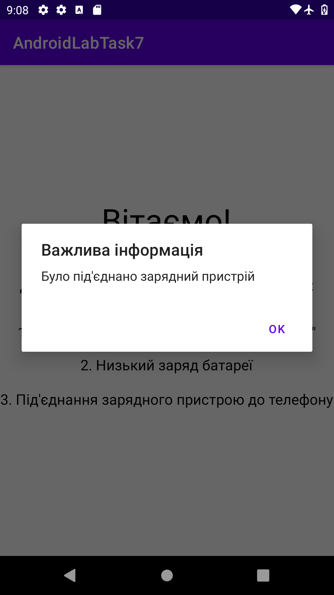
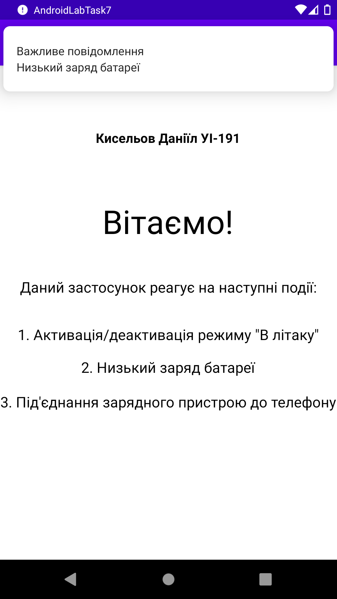
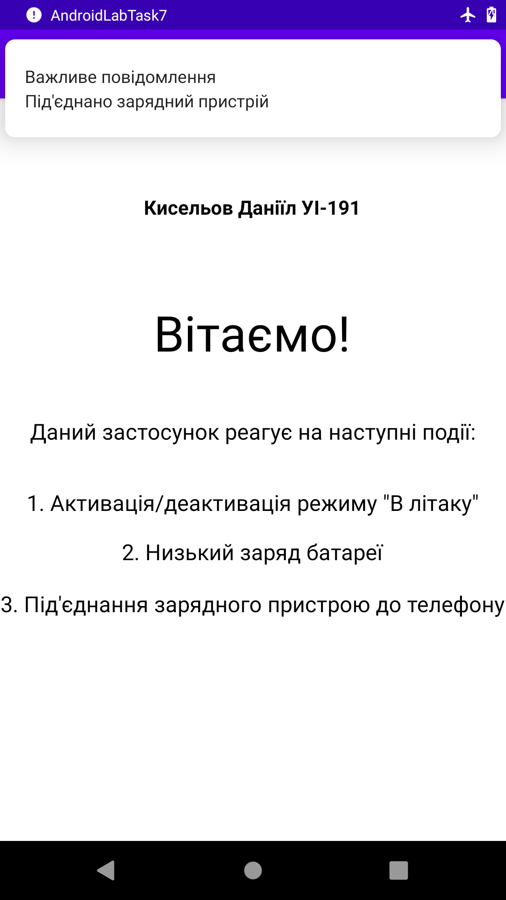
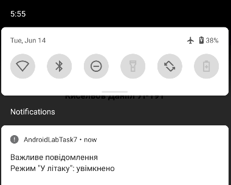
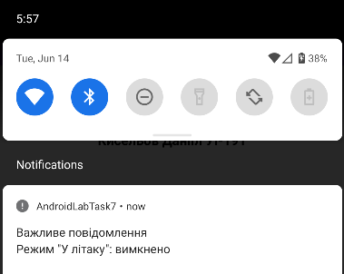

## Лабораторна робота №7
# Робота з широкомовними повідомленнями та сповіщеннями
 
Робота зі створеним застосункому представлена на скриншотах нижче.

# Завдання 1
В результаті було виконання завдання було створено програму, яка 
показує діалогове вікно з інформаційним повідомленням за наступних подій:
- низький заряд батареї;
- натискання кнопки камери;
- увімкнення та вимкнення режиму "в літаку" 
(у приймачі дізнайтеся, чи був режим увімкнено або вимкнено і видайте різне повідомлення в діалоговому вікні).

Варто відмітити, що дана робота виконувалась на емуляторі. Через це, не вдалося емулювати натискання на кнопку 
камери та фіксацію відповідної події.
Дана подія була замінена на під'єднання зарядного пристрою до телефону (Intent.ACTION_POWER_CONNECTED).

Початковий вигляд головного вікна програми:

  

Діалог при увімкненні та вимкненні режиму "в літаку":

Увімкнено:

  

 

Вимкнено:

  

Діалог при низькому заряді батареї:

  

Діалог при під'єднанні зарядного пристрою (замість натискання на кнопку камери):

  

# Завдання 2
В ході виконання цього завдання діалоги були замінені на сповіщення.
Сповіщення про низький заряд батареї:

  

Сповіщення про під'єднання зарядного пристрою:

  

Сповіщення про увімкнення режима "в літаку":

  

Сповіщення про вимкнення режима "в літаку":

  

